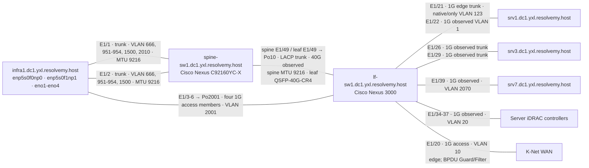
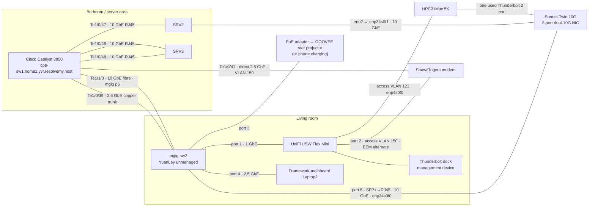

# CoRE deployment environment

This document records the real environment for which the Cluster Operations
chart and Bare Metal Provisioning System are being developed. It is deployment
context, not a statement of the chart's minimum requirements or a portable
reference architecture.

Inventory and capacity figures are operator-reported and current as of August
2026. Keep this document synchronized with the inventory source of truth
as the fleet changes.

## Operational scope

CoRE is a solo-operated private cloud distributed across two sites in two
Canadian provinces. Nine servers are presently managed across the sites, with
additional systems held in production or inventory. The available fleet
provides approximately:

- 1.6 TiB of aggregate RAM.
- 500 aggregate CPU cores.
- Thirteen server, workstation, and mobile systems across production and
  inventory.

The platform is designed to preserve remote access when an individual site
fails. Site independence therefore includes more than Kubernetes workload
placement: routing, identity dependencies, management access, and the
bootstrap path must remain usable or have a documented alternative during a
site outage.

## Compute fleet

| Quantity | System | Notes |
| ---: | --- | --- |
| 7 | Dell PowerEdge R620 | Rack-server fleet spanning production and inventory. |
| 1 | Dell PowerEdge R720xd | Storage-oriented rack server. |
| 2 | Dell PowerEdge R730xd | Newer storage-oriented rack servers. |
| 1 | Framework Laptop, 11th-generation Intel Core i5 | 40 GiB RAM. |
| 1 | Apple iMac 5K, Late 2015 | 32 GiB RAM. |
| 1 | Intel Core i7-8700K system | 32 GiB RAM. |

Not every inventoried system should be assumed to be an active Kubernetes node
or part of a critical quorum. Workstation and mobile-class systems can be
useful as development, lab, edge, or recovery capacity but have different
power, storage, and remote-management characteristics from the PowerEdge
fleet.

Hardware inventory should eventually be generated from NetBox/IPAM rather than
maintained manually in this document.

## Sites

### YXL/DC1 site

#### Inventory

##### Servers

The following records are the authoritative hardware inventory for the YXL
data-centre systems as of August 2026. Names in this section are canonical;
legacy identifiers are intentionally omitted from this public documentation.
Site, rack,
addressing, Kubernetes placement, and workload assignments remain defined by
the deployment manifests and IPAM records.

##### Legacy K3s infrastructure

###### Infra1

| Field | Current record |
| --- | --- |
| Platform / identity | Dell PowerEdge R620; acquired on eBay in 2018 |
| Role and software | Legacy K3s server; Flatcar Container Linux; not a May 2026 cluster addition |
| CPU | 2 × Intel Xeon E5-2690 @ 2.90 GHz; 8 cores / 16 threads per CPU; 16 physical cores / 32 hardware threads total |
| Memory | 384 GB DDR3 ECC; 24 × 16 GB, all 24 slots populated; dual-rank; rated 1600 MHz, operating at 1333 MHz |
| DIMMs | 16 × Kingston `9965516-496.A00LF`; 8 × Hynix `HMT42GR7BFR4A-PB` |
| Storage controller | Dell PERC H710 Mini; encryption capable |
| Virtual disk | RAID5; 64 KB stripe; Write Back Force / Read Ahead; 438,489,317,376 bytes; metadata span length 4 disks |
| Physical disks currently detected | Bay 1, Bay 2, and Bay 5: Seagate `ST9146803SS`, 146,163,105,792 bytes each, SAS 6 Gb/s |
| Networking | Integrated Broadcom BCM5720 (4 × 1 GbE); Intel XXV710 add-in (2 × 25 GbE SFP28), PCIe slot 3 |
| Power | 1 × Dell 750 W PSU installed; slot 2 absent |
| Management | iDRAC7 Enterprise |

##### May 2026 cluster additions

###### SRV1

| Field | Current record |
| --- | --- |
| Platform / identity | Dell PowerEdge R620; added to the cluster in May 2026 |
| CPU | 2 × Intel Xeon E5-2697 v2 @ 2.70 GHz; 12 cores / 24 threads per CPU; 24 physical cores / 48 hardware threads total |
| Memory | 128 GB DDR3 ECC; 8 × 16 GB in 8 of 24 slots; dual-rank; operating at 1333 MHz |
| DIMMs | 5 × Hynix `HMT42GR7MFR4A-H9`; 3 × Hynix `HMT42GR7AFR4A-H9` |
| Storage | Dell PERC H710 Mini, encryption capable; one HGST `HUC101212CSS600`, 1,199,638,052,864 bytes (~1.2 TB), SAS 6 Gb/s, bay 0 |
| Virtual disk | RAID0 single-disk span; 64 KB stripe; Write Back / Adaptive |
| Networking | Integrated Intel I350-t rNDC; 4 × 1 GbE |
| Power | 2 × Dell 750 W PSUs providing redundant power |
| Management | iDRAC7 Enterprise |

###### SRV3

| Field | Current record |
| --- | --- |
| Platform / identity | Dell PowerEdge R620; added to the cluster in May 2026 |
| CPU | 2 × Intel Xeon E5-2697 v2 @ 2.70 GHz; 12 cores / 24 threads per CPU; 24 physical cores / 48 hardware threads total |
| Memory | 128 GB DDR3 ECC; 8 × 16 GB in 8 of 24 slots; dual-rank; operating at 1333 MHz |
| DIMMs | 8 × Hynix `HMT42GR7AFR4A-H9` |
| Storage | Dell PERC H710 Mini, encryption capable; one HGST `HUC101212CSS600`, 1,199,638,052,864 bytes (~1.2 TB), SAS 6 Gb/s, bay 0 |
| Virtual disk | RAID0 single-disk span; 64 KB stripe; Write Back / No Read Ahead |
| Networking | Integrated Intel I350-t rNDC; 4 × 1 GbE |
| Power | 2 × Dell 750 W PSUs providing redundant power |
| Management | iDRAC7 Enterprise |

###### SRV7

| Field | Current record |
| --- | --- |
| Platform / identity | Dell PowerEdge R720xd; added to the cluster in May 2026 |
| CPU | 2 × Intel Xeon E5-2630 v2 @ 2.60 GHz; 6 cores / 12 threads per CPU; 12 physical cores / 24 hardware threads total |
| Memory | 384 GB DDR3 ECC; 24 × 16 GB, all 24 slots populated; dual-rank; rated 1600 MHz, operating at 1333 MHz |
| DIMMs | Samsung `M393B2G70QH0-YK0` |
| Storage/controller | Integrated Broadcom/LSI SAS2308 PCI-Express Fusion-MPT SAS-2 controller (PCI vendor/device Broadcom/LSI SAS2308) |
| Storage limits | The current XML export has no normal DCIM controller, physical-disk, or virtual-disk records. RAID level, drive count/capacity, and virtual-disk layout are therefore unknown; any independently documented storage details not contradicted here remain valid. |
| Networking | Integrated Intel I350-t rNDC (4 × 1 GbE); Mellanox ConnectX-3 Pro (`MT27520 Family [ConnectX-3 Pro]`) in PCIe Gen 3 x16 slot 6. Port count/link speed beyond existing independent documentation is unknown. |
| Power | 2 × Dell 1100 W redundant PSUs |
| Management | iDRAC7 Enterprise |

##### Scoped capacity totals

These totals are intentionally separate from the broad fleet estimates above:

| Scope | Servers | Physical cores | Hardware threads | Installed RAM |
| --- | ---: | ---: | ---: | ---: |
| May 2026 cluster additions (SRV1 + SRV3 + SRV7) | 3 | 60 | 120 | 640 GB |
| All four records in this update (Infra1 + SRV1 + SRV3 + SRV7) | 4 | 76 | 152 | 1,024 GB |

Infra1's capacity is not included in the May 2026 cluster-additions total
because it remains a legacy K3s system.

#### Network

The switching fleet consists of:

| Quantity | Model | Intended role |
| ---: | --- | --- |
| 2 | Cisco Nexus 92160YC-X | One data-centre switch at YVR and one at YXL. |
| 1 | Cisco Nexus N3K-C3172TQ-10GT | 10 GbE aggregation/access switching at YXL. |
| 1 | Cisco Catalyst 3850 | Campus/access and management connectivity. |

The platform uses data-centre networking concepts including BGP, OSPF, VLANs,
multi-NIC hosts, SR-IOV, and routed Kubernetes networking. Switch
configuration, firmware, topology, address allocation, and out-of-band
management paths are external dependencies of this chart and must be backed up
and documented with the same care as the Kubernetes control plane.

The Nexus 92160YC-X switches are separated by site and are not configured as a
redundant pair. Having one Nexus at each site does not by itself provide local
switching redundancy. Cross-site placement improves site-failure separation,
while shared power, management, carrier, configuration, and routing-policy
dependencies must still be considered explicitly.

##### Fabric inventory and YXL/DC1 network

###### Switch inventory

The verified YXL switching records use these canonical device identities. The
`spine0` and `lf1` names found in interface descriptions are historical or
alternate description aliases, not additional switch inventory objects.

| Hostname | Hardware | Role | Software / BIOS |
| --- | --- | --- | --- |
| `spine-sw1.dc1.yxl.resolvemy.host` | Cisco Nexus C92160YC-X | Spine | NX-OS 9.3(14) / BIOS 07.69 |
| `lf-sw1.dc1.yxl.resolvemy.host` | Cisco Nexus 3000-series, N3K-C3172TQ-10GT | Leaf / aggregation-access | NX-OS 9.3(12) / BIOS 5.3.1 |

The relevant upstream references are the [Cisco Nexus 9000 NX-OS 9.3(x)
interfaces guide](https://www.cisco.com/c/en/us/td/docs/switches/datacenter/nexus9000/sw/93x/interfaces/configuration/guide/b-cisco-nexus-9000-nx-os-interfaces-configuration-guide-93x.html)
and [Cisco Nexus 3000 NX-OS 9.3(x) interfaces
guide](https://www.cisco.com/c/en/us/td/docs/switches/datacenter/nexus3000/sw/interfaces/93x/configuration/guide/b-cisco-nexus-3000-nx-os-interfaces-configuration-guide-93x.html).

###### Physical topology

The following topology reflects the documented interface descriptions and leaf
adjacency. It shows physical attachment and logical aggregation; an
operationally connected state is not a permanent availability guarantee.

The drawing intentionally omits endpoints and paths not established by the
documented network records. The spine and leaf E1/49 interfaces are represented
as one Po10 relationship because both sides identify the same LACP
spine-to-leaf connection; no second physical member is documented.

###### Switching and interfaces

###### Spine switch

Configured interfaces on `spine-sw1.dc1.yxl.resolvemy.host`:

| Interface | Peer / description | Mode and VLANs | Link settings |
| --- | --- | --- | --- |
| `Ethernet1/1` | `enp5s0f0np0.infra1.dc1.yxl.resolvemy.host` | Layer-2 trunk; 666, 951-954, 1500, 2010 | MTU 9216; administratively enabled |
| `Ethernet1/2` | `enp5s0f1np1.infra1.dc1.yxl.resolvemy.host` | Layer-2 trunk; 666, 951-954, 1500 | MTU 9216; administratively enabled |
| `Ethernet1/49` | Toward `lf-sw1` (`lf1` in description) | Layer-2 trunk; 1, 5, 10, 15, 20, 110, 121, 123, 951-954, 1500, 2010-2011, 2021, 2070 | MTU 9216; channel-group 10, LACP active; administratively enabled |

Ethernet1/1 and Ethernet1/2 deliberately have different allowed VLAN lists:
VLAN 2010 is allowed on E1/1 but not E1/2. This documented asymmetry is the
configured state and has not been corrected or interpreted as an error.

###### Leaf switch and port channels

The leaf ports below were operationally observed as connected at the listed
speed. These point-in-time observations establish attachment and mode, not a
permanent link-state guarantee.

| Interface | Endpoint / description | Observed mode / VLAN | Observed speed |
| --- | --- | --- | ---: |
| `Ethernet1/3` | `eno1.infra1.dc1.yxl.resolvemy.host` | Access VLAN 2001; LACP member of Po2001 | 1G |
| `Ethernet1/4` | `eno2.infra1.dc1.yxl.resolvemy.host` | Access VLAN 2001; LACP member of Po2001 | 1G |
| `Ethernet1/5` | `eno3.infra1.dc1.yxl.resolvemy.host` | Access VLAN 2001; LACP member of Po2001 | 1G |
| `Ethernet1/6` | `eno4.infra1.dc1.yxl.resolvemy.host` | Access VLAN 2001; LACP member of Po2001 | 1G |
| `Ethernet1/20` | K-Net WAN uplink | Access VLAN 10; edge; BPDU Guard and BPDU Filter | 1G |
| `Ethernet1/21` | `eno1.srv1.dc1.yxl.resolvemy.host` | Trunk; native VLAN 123; allowed VLAN 123 only; edge trunk | 1G |
| `Ethernet1/22` | `eno2.srv1.dc1.yxl.resolvemy.host` | Observed VLAN 1; detailed switchport configuration not documented | 1G |
| `Ethernet1/26` | `eno2.srv3.dc1.yxl.resolvemy.host` | Trunk; allowed VLANs 10, 951-954, 1500; edge trunk | 1G |
| `Ethernet1/29` | `eno1.srv3.dc1.yxl.resolvemy.host` | Trunk | 1G |
| `Ethernet1/34` | `idrac.srv3.dc1.yxl` | VLAN 20 | 1G |
| `Ethernet1/35` | `idrac.srv1.dc1.yxl` | VLAN 20 | 1G |
| `Ethernet1/36` | `idrac.infra1.dc1.yxl` | VLAN 20 | 1G |
| `Ethernet1/37` | `idrac.srv7.dc1.yxl` | VLAN 20 | 1G |
| `Ethernet1/39` | `eno1.srv7.dc1.yxl.resolvemy.host` | Observed VLAN 2070 | 1G |
| `Ethernet1/49` | Toward `spine-sw1` (`spine0` in description) | Trunk; QSFP-40G-CR4 | 40G |

Ethernet1/3-6 are configured identically as four physical 1 GbE members of
LACP port-channel `Po2001`, and `Po2001` was observed connected on VLAN 2001.
The four member rates do not by themselves establish an aggregate 4 Gbit/s
operating rate. On the spine, E1/49 is an LACP-active member of `Po10`; the
leaf `Po10` was observed connected as a 40G trunk, so these records describe
one spine-to-leaf logical relationship.

Ethernet1/20 has LLDP transmit/receive and CDP disabled, is a spanning-tree
edge port, and has BPDU Guard and BPDU Filter enabled. The documented settings
establish the physical K-Net attachment and its VLAN 10 access configuration
but do not identify provider-side equipment or routing behavior.

The retained `switchport access vlan 20` line on Ethernet1/26 is recorded as a
configuration oddity: the interface was operating as a trunk with allowed
VLANs 10, 951-954, and 1500. It does not establish VLAN 20 as the trunk native
VLAN. Ethernet1/22 is likewise documented at the observed VLAN 1 because its
available configuration contains only a description.

###### VLAN inventory

The following VLANs are documented for the YXL switching fabric. Names and
purposes follow the network records and existing authoritative repository
configuration.

TODO: Document VLANs.

| VLAN | Documented purpose / evidence |
| ---: | --- |
| 1 | Present on the spine interconnect; observed on leaf Ethernet1/22 |
| 5, 15, 110, 121, 123, 2010, 2011, 2021 | Carried by the configured spine E1/49 trunk |
| 10 | K-Net Private WAN / K-Net WAN attachment |
| 20 | YXL management / out-of-band access; used by iDRAC interfaces |
| 666 | L2 VXLAN Lab |
| 951-954 | Underlay-related leaf networks |
| 1000 | VXLAN LAN L3 |
| 1010 | VXLAN KNT-PrivWAN |
| 1500 | Present on spine trunks and the srv3 Ethernet1/26 trunk |
| 2001 | infra1 access and LACP port-channel Po2001 |
| 2070 | srv7 attachment VLAN |

This list records VLAN 2010 on the spine E1/49 trunk and E1/1, but not on
E1/2, preserving the observed trunk-list asymmetry. It does not assert that
the leaf Po10 carries every VLAN listed on the spine, because its complete
allowed-VLAN list is not documented here.

###### Server and management attachments

The stable physical mappings established by the leaf records are:

| System | Leaf attachment |
| --- | --- |
| `infra1.dc1.yxl.resolvemy.host` | `eno1`-`eno4` to Ethernet1/3-6; four 1G access links in Po2001 on VLAN 2001. `enp5s0f0np0` and `enp5s0f1np1` also connect to spine Ethernet1/1-2 |
| `srv1.dc1.yxl.resolvemy.host` | `eno1` to Ethernet1/21; 1G edge trunk, native and only allowed VLAN 123. `eno2` to Ethernet1/22; observed 1G on VLAN 1, detailed configuration not documented |
| `srv3.dc1.yxl.resolvemy.host` | `eno2` to Ethernet1/26; observed 1G trunk. `eno1` to Ethernet1/29; observed 1G trunk |
| `srv7.dc1.yxl.resolvemy.host` | `eno1` to Ethernet1/39; observed 1G on VLAN 2070 |
| Server management controllers | `idrac.srv3`, `idrac.srv1`, `idrac.infra1`, and `idrac.srv7` to Ethernet1/34-37 respectively; observed 1G on VLAN 20 |

The host-side interface names are endpoint identifiers from switch
descriptions. They do not create additional switch identities and are not
evidence of host-side bonding beyond the explicitly documented LACP bundles.

### YVR site

#### Network

##### Network topology and switching

See the [YVR site server inventory](#yvr-site) for the maintenance
records of the compute nodes referenced by this topology.

The Home2 YVR network uses `cpe-sw1.home2.yvr.resolvemy.host`, the Cisco
Catalyst 3850 in the bedroom/server area. It is the main managed access switch
and the main 10 GbE server switch. Living-room `mgig-sw2` is an unmanaged
YuanLey multi-gigabit switch with 4 × 2.5 GbE copper ports and 2 × 10 GbE SFP
ports. It connects the Framework-mainboard Laptop2 node at 2.5 GbE on port 4.
It also connects a UniFi USW Flex Mini, which is downstream of
`mgig-sw2` over 1 GbE; it connects HPC3 (the iMac 5K compute node) at 1 GbE,
the Shaw/Rogers modem, and the Thunderbolt dock used for wired access by a
management laptop or iPad Pro.

The Catalyst 3850 also provides the server-area 10 GbE links: two 10 GbE
RJ45 links terminate on SRV3, and one 10 GbE RJ45 link terminates on SRV2.
HPC3 uses one Thunderbolt 2 port, connected to a Sonnet Twin 10G two-port
dual-10G NIC. One Sonnet NIC port connects to SRV2's other 10 GbE port, and
the other connects to the unmanaged `mgig-sw2` through an SFP+ to RJ45
connection. SRV2 `eno2` connects to HPC3 `enp34s0f1` through the Sonnet NIC.
HPC3 therefore has both its documented 1 GbE connection to the
UniFi USW Flex Mini and this separate 10 GbE path through the living-room
switch.

HPC3 interface mapping is `enp34s0f0` on the external Sonnet Twin 10G NIC to
`mgig-sw2` port 5; `enp4s0f0` is the iMac 5K's internal NIC and connects
to the UniFi USW Flex Mini on an access port on VLAN 121. The UniFi Flex Mini
port 1 uplinks to `mgig-sw2` port 1, port 2 is an access port on VLAN 150 for
the Shaw/Rogers modem. `mgig-sw2` port 3 connects to a PoE adapter for phone
charging or GOOVEE star-projector power.

The current Catalyst 3850 server-port assignments are:

| Interface | Peer | Configuration |
| --- | --- | --- |
| `TenGigabitEthernet1/0/46` | `eno2.srv3.home2.yvr.resolvemy.host` | 10 GbE RJ45 802.1Q trunk; allowed VLANs 1, 20, 21, 30, 31, 50, 131, 150, 151, 1000; STP PortFast trunk |
| `TenGigabitEthernet1/0/47` | `eno1.srv2.home2.yvr.resolvemy.host` | 10 GbE RJ45 802.1Q trunk; allowed VLANs 1, 5, 20, 21, 30, 31, 50, 150, 151, 1000; STP PortFast trunk; BPS history enabled; receive flow control desired; output hold queue 240000 |
| `TenGigabitEthernet1/0/48` | `eno1.srv3.home2.yvr.resolvemy.host` | 10 GbE RJ45 802.1Q trunk; allowed VLANs 1, 20, 21, 30, 31, 50, 150, 151, 1000; STP PortFast trunk; output hold queue 18000 |

The Catalyst 3850 has two physical room-to-room links to `mgig-sw2`:

| Interface | Link and allowed VLANs | Switching/STP configuration |
| --- | --- | --- |
| `Te1/1/3` | 10 GbE fibre to `mgig-sw2` port 6 (`p6.mgig-sw2.home2.yvr.resolvemy.host`); VLANs 1, 5, 8, 20, 21, 30, 50, 121, 151, 666 | 802.1Q trunk; BPS history enabled; receive flow control off; STP point-to-point; VLANs 1, 5, 20, 666 priority 64; output hold queue 240000 |
| `Te1/0/39` | 2.5 GbE copper to `mgig-sw2.lvng-rm.home2.yvr.resolvemy.host` port 5; VLANs 1, 5, 7, 8, 20, 21, 121, 666 under normal operation | 802.1Q trunk; BPS history enabled; receive flow control off; STP point-to-point; VLANs 5, 7-8, 20, 121 priority 32; output hold queue 1000 |

These links deliberately form a Layer-2 loop through the unmanaged YuanLey
switch. The Catalyst 3850 controls the loop with per-VLAN Spanning Tree
behavior. `mgig-sw2` acts as an unmanaged, transparent Layer-2 segment; the
Catalyst 3850 makes the STP forwarding or blocking decisions. Neither link is
universally primary or backup: STP operates per VLAN, the trunks carry
different VLAN sets, their port priorities differ, and the forwarding state
depends on the VLAN.

The resulting STP path choices can be read as follows (VLAN 150 is excluded
and uses the separate EEM failover described below):

| VLANs | Te1/1/3 | Te1/0/39 | STP path guidance |
| --- | --- | --- | --- |
| 1, 666 | Allowed; priority 64 | Allowed; default priority | Te1/1/3 is preferred by its lower configured priority; Te1/0/39 can be blocking. |
| 5, 20 | Allowed; priority 64 | Allowed; priority 32 | Te1/0/39 is preferred by its lower configured priority; Te1/1/3 can be blocking. |
| 8 | Allowed; default priority | Allowed; priority 32 | Te1/0/39 is preferred by its lower configured priority. |
| 21 | Allowed; default priority | Allowed; default priority | STP selects using the remaining topology and bridge/path information. |
| 7, 121 | Not allowed | Allowed | Te1/0/39 is the only trunk path. |
| 30, 50, 151 | Allowed | Not allowed | Te1/1/3 is the only trunk path. |

“Preferred” describes the configured priority bias, not a permanent primary
link: STP may change forwarding or blocking state when topology or upstream
root-path conditions change.

##### VLAN 150 WAN failover

VLAN 150 is the Shaw/Rogers WAN VLAN. Its normal physical attachment is the
direct 2.5 GbE modem connection on `TenGigabitEthernet1/0/41`, configured as
an access port on VLAN 150 with PortFast enabled. VLAN 150 is
normally absent from `Te1/0/39` and is not part of the normal STP-redundant LAN
topology.

Catalyst IOS Embedded Event Manager provides physical-path failover. EEM
triggers on loss of Ethernet link/carrier on `Te1/0/41`; an upstream
Shaw/Rogers outage that leaves the Ethernet link up does not trigger this
mechanism. When `Te1/0/41` goes down, the `VLAN150_FAILOVER_ENABLE` applet
executes
`switchport trunk allowed vlan add 150` on `Te1/0/39`, extending the WAN VLAN
through the living-room path. When the direct link recovers, the
`VLAN150_FAILOVER_DISABLE` applet executes
`switchport trunk allowed vlan remove 150` on `Te1/0/39`. EEM changes VLAN
membership; it does not perform routing failover.

#### Inventory

##### Servers

The following YVR records capture stable maintenance information for the
inventoried systems.

###### SRV3

| Field | Current record |
| --- | --- |
| Platform / identity | Canonical name SRV3; hostname `srv3.home2.yvr.resolvemy.host`; Dell PowerEdge R730xd, 2U, 13th generation |
| CPU | 2 × Intel Xeon E5-2680 v3 @ 2.50 GHz; 12 cores / 24 threads per CPU; 24 physical cores / 48 hardware threads total |
| Memory | 64 GB DDR4 ECC; 2 × 32 GB; quad-rank; 2133 MHz |
| DIMMs | 2 × Samsung `M386A4G40DM0-CPB`; DIMM A1 + B1; 2 of 24 DIMM slots populated |
| Storage controller | Dell PERC H730 Mini; embedded PERC S130 also enumerated |
| Backplane | 24 drive slots |
| Physical storage currently inventoried | Bay 0: HGST `HUC101212CSS600`, ~1.2 TB, 2.5-inch SAS 6 Gb/s |
| Storage layout | No RAID or virtual-disk layout is documented; the inventory export contains no virtual-disk records. |
| Networking | Intel X540/I350 four-port rNDC: 2 × 10 GbE Base-T and 2 × 1 GbE Base-T |
| Power | 2 × Dell 750 W PSUs installed |
| Management | iDRAC8 Enterprise |

###### SRV2

| Field | Current record |
| --- | --- |
| Platform / identity | Canonical name SRV2; hostname `srv2.home2.yvr.resolvemy.host`; Dell PowerEdge R730xd, 2U, 13th generation |
| CPU | 2 × Intel Xeon E5-2650 v4 @ 2.20 GHz; 12 cores / 24 threads per CPU; 24 physical cores / 48 hardware threads total |
| Memory | 128 GB DDR4 ECC; 8 × 16 GB; dual-rank; rated and operating at 2133 MHz; balanced 64 GB per processor / four DIMMs per CPU |
| DIMMs | 2 × Micron `36ASF2G72PZ-2G1A2` (A1, B1); 6 × Samsung `M393A2G40DB0-CPB` (A2-A4, B2-B4); 8 of 24 DIMM slots populated |
| Storage controller | Dell PERC H730 Mini; embedded PERC S130 also enumerated |
| Backplane | 14 drive slots reported by inventory |
| Physical storage currently inventoried | Bay 12: HGST `HUC101212CSS600`, ~1.2 TB SAS HDD; Bay 13: WDC `WD5000LPLX`, ~500 GB SATA HDD |
| Storage layout | Both inventoried disks are exposed as Non-RAID; no virtual-disk record is present. |
| Networking | Intel X540/I350 four-port rNDC: 2 × 10 GbE Base-T and 2 × 1 GbE Base-T |
| Power | 2 × Dell 750 W PSUs installed |
| Management | iDRAC8 Enterprise |

###### Non-rack compute nodes

####### HPC2

| Field | Current record |
| --- | --- |
| Platform | Custom workstation-class node; Gigabyte AORUS Gaming 7 motherboard |
| CPU | Intel Core i7-8700K; 6 cores / 12 threads |
| Memory | 32 GB DDR4-3600 installed |
| GPU | NVIDIA GeForce RTX 2080 Founders Edition |
| PSU | Corsair SF750 (2024), 750 W, 80 Plus Platinum |
| Storage | 1 TB NVMe (historically documented) |
| Role | Talos/Kubernetes compute node with KubeVirt and GPU workloads |

####### HPC3

| Field | Current record |
| --- | --- |
| Platform | Apple iMac17,1, Retina 5K 27-inch, Late 2015 |
| CPU | Intel Core i7-6700K; 4 cores / 8 threads |
| Memory | 32 GB DDR3-1867 installed |
| GPU | AMD Radeon R9 M395, 2 GB GDDR5 |
| Storage | 2 TB NVMe SSD plus 2 TB HDD |
| Role | Talos/Kubernetes compute node |
| Networking | Built-in 1 GbE interface to the UniFi USW Flex Mini on VLAN 121; Sonnet Twin 10G dual-port adapter over Thunderbolt 2; `enp34s0f0` at 10 GbE to `mgig-sw2`; `enp34s0f1` at 10 GbE directly to SRV2 `eno2` |

####### Laptop2

| Field | Current record |
| --- | --- |
| Identity / platform | Laptop2; Framework 11th-generation Intel mainboard node |
| CPU | Intel Core i5-1135G7, Tiger Lake; 4 cores / 8 threads |
| Role | Talos/Kubernetes worker-class node with KubeVirt capability |
| Memory | 40 GiB installed |
| Networking | 2.5 GbE connection to living-room `mgig-sw2` port 4 |
| Physical placement | Home2/YVR living-room network segment |
| Platform characteristics | Mobile/desktop-class compute platform with different power, storage, and remote-management characteristics from the PowerEdge fleet |

## Operator workflow

Day-to-day development is performed through Eclipse Che environments running
on the platform. Authentik provides the interactive login path, allowing the
operator to access the development environment and integrated services through
single sign-on.

This is an important production workload and a practical health check for the
platform: identity, ingress, certificates, DNS, storage, networking,
Kubernetes scheduling, and the Che control plane must all work for a
development session to start.

Maintain an access path that does not depend on Authentik, Eclipse Che, or the
primary Kubernetes cluster for emergency recovery. Emergency credentials must
be strongly protected, periodically tested, and usable through the
out-of-band-management network.

## Availability experience

No formal measured service-level objective is currently asserted. Planned
maintenance, total outages, partial degradation, and individual service
failures need consistent definitions before an availability percentage can be
asserted.

The first services worth measuring from the user's perspective are:

- Authentik authentication success and latency.
- Eclipse Che workspace-start success and duration.
- DNS, ingress, and certificate availability.
- Management and out-of-band access at each site.
- Kubernetes API and Crossplane reconciliation health.
- Bare-metal provisioning success and duration.

## Failure-domain expectations

The target behavior during a single-site failure is:

- The surviving site remains remotely reachable.
- Operators retain an authentication-independent emergency access path.
- Routing converges without manual access to the failed site.
- The surviving management plane exposes enough state to diagnose the outage.
- Backups remain accessible from a failure domain separate from the affected
  site.
- Recovery does not require services that existed only at the failed site.

Not every application must necessarily remain available during a site outage.
Critical services, their recovery objectives, and whether they run
active/active, active/passive, or restore-on-demand should be documented
explicitly rather than inferred from the physical topology.

## Capacity is not an availability guarantee

The fleet has substantial aggregate capacity, but schedulable capacity is
constrained by site placement, hardware generation, memory locality, storage,
network bandwidth, quorum requirements, power, cooling, and maintenance
headroom. Capacity reporting should distinguish:

- Installed inventory.
- Powered and reachable hardware.
- Kubernetes-ready allocatable capacity.
- Capacity reserved for failover.
- Capacity unavailable because of maintenance or faults.

The cluster API and future inventory integration should expose these
distinctions instead of presenting aggregate core and memory totals as a
single interchangeable pool.
